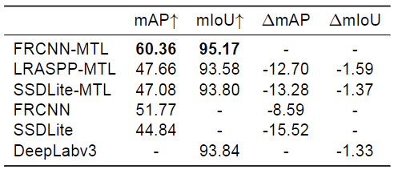

Multi-task learning with task balancing on the Lightning-AI framework
==============================

The repository if for the source code for the master thesis **"Multi-task learning for robust autonomy in mobile robotics"**. Relevant parts from the abstract:

_This work investigates the application of lightweight multi-task learning  (MTL) for mobile robotics (...) the main focus of this project is state-of-the-art loss and gradient-based balancing methods for MTL architectures, particularly improvements in model performance and inference time. Compared to recent work, an extensive combination of balancing approaches is explored, and their benefits on a dataset from a real-world use case are proven. Results suggest 17.06\% mAP improvement for object detection using MTL with task-balancing, compared to the equivalent baseline method. (...)_

The following table shows the improvement on a collected 2000 image dataset for a binary semantic segmentation task (mIoU) and a four class object detection task (mAP).

<p align="center">
  
</p>

The repository uses pre-trained `torchvision` models and combines them to multi-task architectures with the following naming:

| Acronym     	| Explanation                              	|
|-------------	|------------------------------------------	|
| FRCNN       	| Faster-RCNN                              	|
| FRCNN-MTL   	| Faster-RCNN + DeepLabv3 MTL architecture 	|
| SSDLite-MTL 	| SSDLite + DeepLabv3 MTL architecture     	|
| LRASPP-MTL  	| SSDLite + LRASPP MTL architecture        	|

Moreover, the implementation includes the following task-balancing methods:

| Abbreviation 	| Source                                                                                                                                                                      	|
|--------------	|-----------------------------------------------------------------------------------------------------------------------------------------------------------------------------	|
| DWA          	| Liu, S. et al. (2022). _Auto-Lambda: Disentangling Dynamic Task Relationships_                        	|
| Uncertainty  	| Kendall, A. et al. (2017). _Multi-Task Learning Using Uncertainty to Weigh Losses for Scene Geometry and Semantics._	|
| BMTL         	| Liang, S. et al. (2020). _A Simple General Approach to Balance Task Difficulty in Multi-Task Learning._                       	|
| Graddrop     	| Yu, T. et al. _Gradient Surgery for Multi-Task Learning._         	|
| CAGrad       	| Liu, B. et al. _Conflict-Averse Gradient Descent for Multi-task Learning_                  	|
| PCGrad       	| Chen, Z.et al. _Just Pick a Sign: Optimizing Deep Multitask Models with Gradient Sign Dropout._ 	|


Installation
------------
>[!Warning] I did not have too much time for this yet, please look trhough the Makefile!

Start by automatcially generating an environment for *conda* or *venv* with the following command in the top directory:
```shell
$ make create_environment
``` 
After activating this environment, install the requirements:
```shell
$ make requirements
```
Install pre-commit hooks for formatting tests, defined in `.pre-commit-config.yaml`:
```shell
$ pre-commit install
```

If you want to use the VSCode debugger with the virtual environment, append the following to the `launch.json` profile.

```shell
$ "python": "${command:python.interpreterPath}"
```

Install logging with Weights & Biases and provide API key for your profil.

```shell
$ wandb login
```
---
User guide for model training
---

### Callbacks

Model training can be initialized and executed based on parameters in the provided configuration file, which defaults to `/configs/debug_foo.yaml`

```shell
$ python3 src/pipeline/train_model.py -c /configs/<your-config-file>.yaml
```

Everything in the training pipeline is agnostic to models, tasks and hyper parameters, so training a new model, the only thing to change is the config `.yaml` file. `debug_foo.yaml` is commented for options and can be used as a template.

Model and task balancing selection is in this block, consult `/src/models/model_loader.py` and `/src/features/loss_balancing.py` for their use.

```YAML
model: frcnn-hybrid # OPTIONS: [deeplabv3, ssdlite, frcnn(-resnet), frcnn-hybrid, ssdlite-hybrid, lraspp-hybrid]
attribute: debug # OPTIONAL description, can be left empty
weight: equal # OPTIONS: [equal, constant, uncertainty, dynamic, autol]
w_constant: # starting contant (float) weighting values [detection, segmentation]
grad_method:  # OPTIONS: [None, graddrop, pcgrad, cagrad]
temperature: 0.2
```

---
User guide for data handling
------------
### Unpacking the bagfiles from `/data/external` to `/data/raw/`

Use `-f True` if you want to overwrite already extracted bags in `data/raw`, otherwise they are skipped.

```shell
$ python src/data/rosbag_unpack.py
```
### Pruning the images from `/data/raw` to `/data/interim`

Similarity limit accoring to the SSIM measure (read more [here](https://pyimagesearch.com/2014/09/15/python-compare-two-images/)). The limit can be adjusted by passing `-s <float>`.

It will skip folders that has been already pruned and have an existing folder in the target directory `/data/interim`. This can be bypassed with `-f`. 

Individual bag can be extracted by passing `-b -i <path_to_bag>`, which assumes that the output folder can be overwritten, if it exists.

Passing `-d` will enable debug level logging information and limit the loop to the last bag in the list.

```shell
$ python src/data/filter_images.py -s 0.7
```
---

Issues
---

In case of `ModuleNotFoundError: No module named 'src'`, you should append the following to the end of the environment activation file and restart the virtual environment.

```shell
$ echo 'export PYTHONPATH=$PYTHONPATH:$(pwd)' >> ~/.virtualenvs/multitask-mayhem/bin/activate
```
or
```shell
$ conda install conda-build
$ conda develop . 
```


Project Organization
------------

    ├── LICENSE
    ├── Makefile           <- Makefile with commands like `make data` or `make train`
    ├── README.md          <- The top-level README for developers using this project.
    ├── data
    │   ├── external       <- Data from third party sources.
    │   ├── interim        <- Intermediate data that has been transformed.
    │   ├── processed      <- The final, canonical data sets for modeling.
    │   └── raw            <- The original, immutable data dump.
    ├── models             <- Trained and serialized models, model predictions, or model summaries
    ├── reports            <- Generated analysis as Png, LaTeX, etc.
    │   └── figures        <- Generated graphics and figures to be used in reporting
    ├── requirements.txt   <- The requirements file for reproducing the analysis environment, e.g.
    │                         generated with `pip freeze > requirements.txt`
    ├── setup.py           <- makes project pip installable (pip install -e .) so src can be imported
    ├── src                <- Source code for use in this project.
    │   ├── __init__.py    <- Makes src a Python module
    │   ├── data           <- Scripts to download or generate data, plus Pytorch DataLoader definition
    │   ├── features       <- Task balancing and other features
    │   ├── models         <- Model constructor and multi-task architectures
    │   ├── pipeline       <- Scripts to train and inference models
    │   └── visualization  <- Scripts to create exploratory and results oriented visualizations
    └── tox.ini            <- tox file with settings for running tox; see tox.readthedocs.io


--------

<p><small>Project based on the <a target="_blank" href="https://drivendata.github.io/cookiecutter-data-science/">cookiecutter data science project template</a>. #cookiecutterdatascience</small></p>
